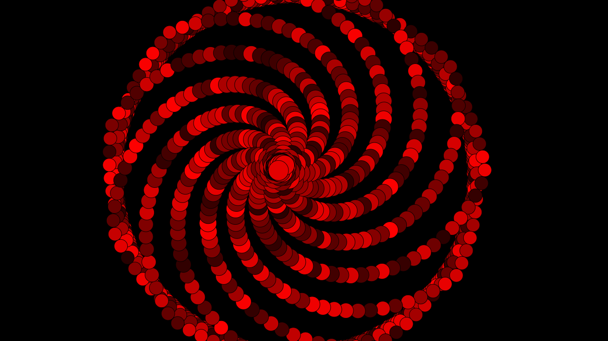

# Sharingan-awakening
<p aling="center">
    
</p>
The Sharinga Awakening is a project to remember one of the main powers of the Uchiha clan.

# Introduction 

Create an HTML file at the root of your project, `index.html` and insert this inside the file:
```html
<!DOCTYPE html>
<html lang="pt-br">
<head>
    <meta charset="UTF-8">
    <meta http-equiv="X-UA-Compatible" content="IE=edge">
    <meta name="viewport" content="width=device-width, initial-scale=1.0">
    <script src="https://cdn.jsdelivr.net/npm/p5@1.4.1/lib/p5.js"></script>
    <script src="script.js"></script>
    <link rel="stylesheet" href="style.css">
    <title>Sharingan</title>
</head>
<body>
</body>
</html>
```
Note that within the html file more files were inserted: `style.css`, `script.js` and the p5.js library.

## P5.JS

p5.js is a JavaScript library for coding creatives, if you are not yet familiar with the library's functions click on the link to learn more [p5.js](https://p5js.org/).

## Trigonometry
The trigonometric circle is used to determine angles in the Cartesian plane from the formation of trigonometric arcs.

The trigonometry functions in p5.js:

- [acos()](https://p5js.org/reference/#/p5/acos)
- [asin()](https://p5js.org/reference/#/p5/asin)
- [atan()](https://p5js.org/reference/#/p5/atan)
- [atan2()](https://p5js.org/reference/#/p5/atan2)
- [cos()](https://p5js.org/reference/#/p5/cos)
- [sin()](https://p5js.org/reference/#/p5/sin)
- [tan()](https://p5js.org/reference/#/p5/tan)
- [degrees()](https://p5js.org/reference/#/p5/degrees)
- [radians()](https://p5js.org/reference/#/p5/radians)
- [angleMode()](https://p5js.org/reference/#/p5/angleMode)


### Circular
- As funções [sin()](https://p5js.org/reference/#/p5/sin) e [cos()](https://p5js.org/reference/#/p5/cos) em p5.js retornam valores entre −1 e 1 para o seno ou cosseno do ângulo especificado.

### Circular Motion

To make the project I started with the following example:

```javascript
var angle = 0.0;
var offset = 60;
var scalar = 2;
var speed = 0.05;
function setup() {
createCanvas(120, 120);
fill(0);
background(204);
}
function draw() {
var x = offset + cos(angle) * scalar;
var y = offset + sin(angle) * scalar;
ellipse(x, y, 2, 2);
angle += speed;
scalar += speed;
}
```

" When sin() and cos() are used together, they can produce circular motion. The cos() values ​​provide the x coordinates, and the
sin() values ​​provide the y coordinates. Both are multiplied by a variable named scalar to change the radius of the movement
and summed with an offset value to set the center of the circular motion: "

Now that you know how to produce a circular motion using the sin() and cos() functions, let's include the following code inside the `script.js` file:

```javascript
let angle = 10;
let offset  = 40;
let scale = 9;
let velocityAngle = 1.8;
let velocityScale = 0.09;
let width = 15, height = 15;
let p5canvas;

function setup() {
    p5canvas = createCanvas(displayWidth,displayHeight);
    background(0);
    frameRate(150);
}

function draw() {
    if(frameCount === (480)) {
        velocityScale = 0.7;
    }
    if(frameCount === (680)) {
        velocityScale = 0.05;
        width = 20;
        height = 20;
    }

    let x = offset  + cos(angle) * scale;
    let y = offset  + sin(angle) * scale;

    fill(random(40,255),0,0);
    ellipse(((displayWidth/2)-width)+x,(( displayHeight/2)-height)+y, width,height);

    angle += velocityAngle;
    scale += velocityScale;
}

```

- Some functionality (loading external files) may show a "cross-source" error in the console. Thus, I recommend, clicking on the link how to configure a [local server on Mac OSX, Windows or Linux.](https://github.com/processing/p5.js/wiki/Local-server)

## Where does the magic happen??
```javascript
 if(frameCount === (480)) {
        velocityScale = 0.7;
    }
    if(frameCount === (680)) {
        velocityScale = 0.05;
        width = 20;
        height = 20;
    }

```
If we remove this part of the pcode we will have the following result:

<p aling="center">
    
</p>

That's not what we want, it's not true.

What we want is to alter the radius of the movement and this is linked to the variable "velocityScale" which receives a new value as a parameter.

The frameCount() function is used to check the execution time inside the draw function in this case the function is executed in the range of 150 frames per second , this was defined by the frameRate function.

With all the code in place, let's get to the result:

<p aling="center">
    
</p>

> Attention: The resolution of the notebook screen that I programmed was 1366 x 768, therefore, I ran the code on my cell phone scrern was also responsive, so I changed velocityScale(480,680), but I didn'design the Sharingan to run on mobile app screens, so I recommend installing [ngrok](https://ngrok.com/) to do your own tests and make the screen responsive.

Now and with you everything will depend on you creativity to create different types of arts:

<p aling="center">
    
    
    
       
</p>

If you have any questions, please contact me by email pedropapoti@gmail.com.


